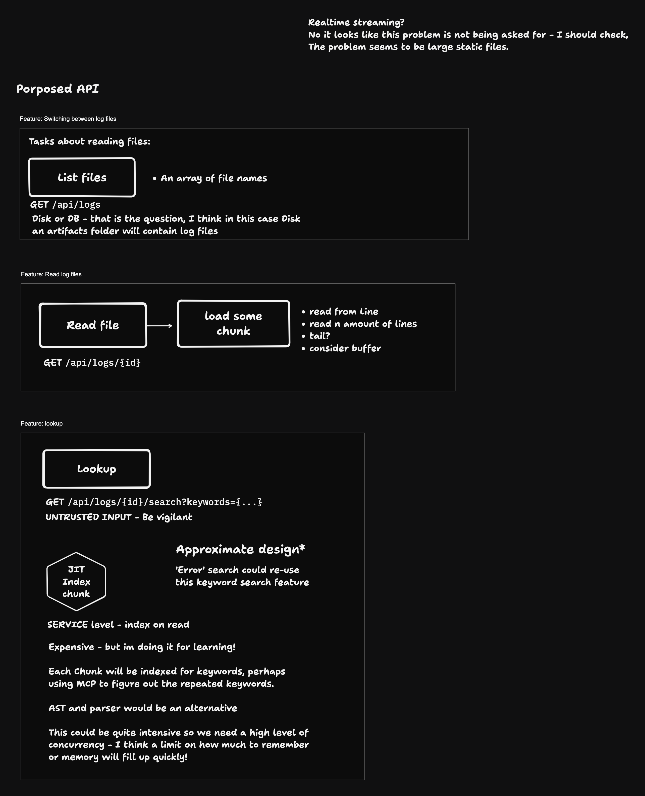

# party-streamer
Tech task: A log streamer

## Meta
- You can see my thoughts on the requirements here:
https://docs.google.com/document/d/18aRtOHwuJSL__AJGflHzg5oI9aoNk-EUYPuvzbJDI7A/edit?tab=t.0
- Docker is not going to be used to ship this, to give you a better chance to review.

## Design
- TLDRAW https://www.tldraw.com/p/CL5z-LoIRzng-31hCtqfk?d=v-64.443.1744.1168.page

